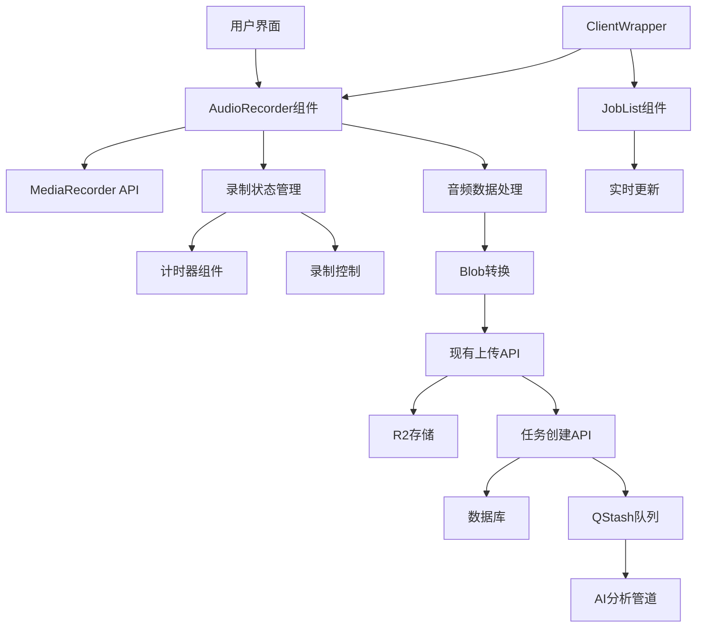

# 设计文档

## 概述

立即录制功能是一个集成到现有Web应用的新模块，允许用户通过浏览器直接录制音频并自动提交到AI分析管道。该功能将复用现有的上传、任务管理和分析基础设施，提供从录制到分析的无缝体验。

## 架构

### 系统架构图



### 技术栈

- **前端录制**: Web MediaRecorder API
- **音频格式**: WebM (浏览器原生支持)
- **状态管理**: React useState/useEffect
- **文件上传**: 现有的预签名URL上传流程
- **任务管理**: 现有的MeetingJob模型和API
- **实时更新**: 现有的Supabase实时订阅

## 组件和接口

### 1. AudioRecorder 组件

**职责**: 核心录制功能组件，处理录制生命周期

**接口**:
```typescript
interface AudioRecorderProps {
  onRecordingComplete?: (audioBlob: Blob, fileName: string) => Promise<void>;
  maxDuration?: number; // 默认30分钟
}

interface AudioRecorderState {
  isRecording: boolean;
  isPaused: boolean;
  duration: number;
  hasPermission: boolean | null;
  error: string | null;
  mediaRecorder: MediaRecorder | null;
}
```

**主要方法**:
- `startRecording()`: 请求权限并开始录制
- `stopRecording()`: 停止录制并生成音频文件
- `pauseRecording()`: 暂停录制（可选功能）
- `resumeRecording()`: 恢复录制（可选功能）

### 2. RecordingTimer 组件

**职责**: 显示录制时间和进度

**接口**:
```typescript
interface RecordingTimerProps {
  duration: number;
  maxDuration: number;
  isRecording: boolean;
}
```

### 3. RecordingControls 组件

**职责**: 录制控制按钮组

**接口**:
```typescript
interface RecordingControlsProps {
  isRecording: boolean;
  onStart: () => void;
  onStop: () => void;
  disabled?: boolean;
}
```

### 4. PermissionHandler 组件

**职责**: 处理麦克风权限相关UI

**接口**:
```typescript
interface PermissionHandlerProps {
  hasPermission: boolean | null;
  onRequestPermission: () => void;
  error?: string | null;
}
```

## 数据模型

### 录制会话数据

```typescript
interface RecordingSession {
  id: string;
  startTime: Date;
  endTime?: Date;
  duration: number;
  status: 'recording' | 'stopped' | 'processing';
  audioChunks: Blob[];
}
```

### 音频文件元数据

```typescript
interface AudioFileMetadata {
  fileName: string;
  mimeType: string;
  size: number;
  duration: number;
  sampleRate?: number;
}
```

## 错误处理

### 权限错误处理

1. **权限被拒绝**:
   - 显示友好的错误提示
   - 提供权限设置指导
   - 提供重新请求权限的选项

2. **设备不可用**:
   - 检测麦克风设备状态
   - 显示设备相关错误信息
   - 提供故障排除建议

### 录制错误处理

1. **录制中断**:
   - 自动保存已录制的音频
   - 显示中断原因
   - 提供恢复录制选项

2. **存储空间不足**:
   - 监控本地存储使用情况
   - 及时警告用户
   - 提供清理建议

3. **网络错误**:
   - 本地缓存录制数据
   - 支持离线录制
   - 网络恢复后自动上传

### 上传错误处理

1. **上传失败**:
   - 自动重试机制
   - 显示上传进度和错误状态
   - 支持手动重新上传

2. **文件格式不支持**:
   - 客户端格式验证
   - 自动格式转换（如需要）
   - 清晰的错误提示

## 测试策略

### 单元测试

1. **AudioRecorder组件测试**:
   - 录制状态管理
   - 权限处理逻辑
   - 音频数据处理
   - 错误处理流程

2. **工具函数测试**:
   - 音频格式转换
   - 时间格式化
   - 文件名生成

### 集成测试

1. **录制流程测试**:
   - 完整录制到上传流程
   - 权限请求和处理
   - 错误场景处理

2. **API集成测试**:
   - 与现有上传API的集成
   - 任务创建和状态更新
   - 实时数据同步

### 浏览器兼容性测试

1. **MediaRecorder API支持**:
   - Chrome, Firefox, Safari, Edge
   - 移动端浏览器支持
   - 降级方案测试

2. **音频格式兼容性**:
   - WebM格式支持测试
   - 音频质量验证
   - 文件大小优化

### 用户体验测试

1. **权限流程测试**:
   - 首次权限请求体验
   - 权限被拒绝后的用户引导
   - 权限恢复流程

2. **录制体验测试**:
   - 录制开始/停止响应性
   - 视觉反馈效果
   - 长时间录制稳定性

## 性能考虑

### 内存管理

1. **音频数据缓存**:
   - 分块处理音频数据
   - 及时释放不需要的音频块
   - 监控内存使用情况

2. **组件优化**:
   - 使用React.memo优化重渲染
   - 合理使用useCallback和useMemo
   - 避免不必要的状态更新

### 网络优化

1. **上传优化**:
   - 复用现有的分块上传机制
   - 压缩音频数据（如适用）
   - 支持断点续传

2. **实时更新优化**:
   - 复用现有的Supabase实时连接
   - 减少不必要的API调用
   - 优化状态同步频率

## 安全考虑

### 隐私保护

1. **音频数据处理**:
   - 本地处理音频数据
   - 不在客户端存储敏感音频
   - 及时清理临时数据

2. **权限管理**:
   - 最小权限原则
   - 清晰的权限说明
   - 用户可控的权限撤销

### 数据安全

1. **传输安全**:
   - 复用现有的HTTPS传输
   - 预签名URL安全机制
   - 文件访问权限控制

2. **存储安全**:
   - 复用现有的R2存储安全配置
   - 用户数据隔离
   - 定期清理过期数据

## 部署和监控

### 部署策略

1. **渐进式部署**:
   - 功能开关控制
   - A/B测试支持
   - 回滚机制

2. **环境配置**:
   - 开发/测试/生产环境配置
   - 功能标志管理
   - 性能监控配置

### 监控指标

1. **功能指标**:
   - 录制成功率
   - 上传成功率
   - 权限授予率
   - 错误发生率

2. **性能指标**:
   - 录制延迟
   - 上传速度
   - 内存使用情况
   - CPU使用情况

3. **用户体验指标**:
   - 录制完成率
   - 用户满意度
   - 功能使用频率
   - 错误恢复率