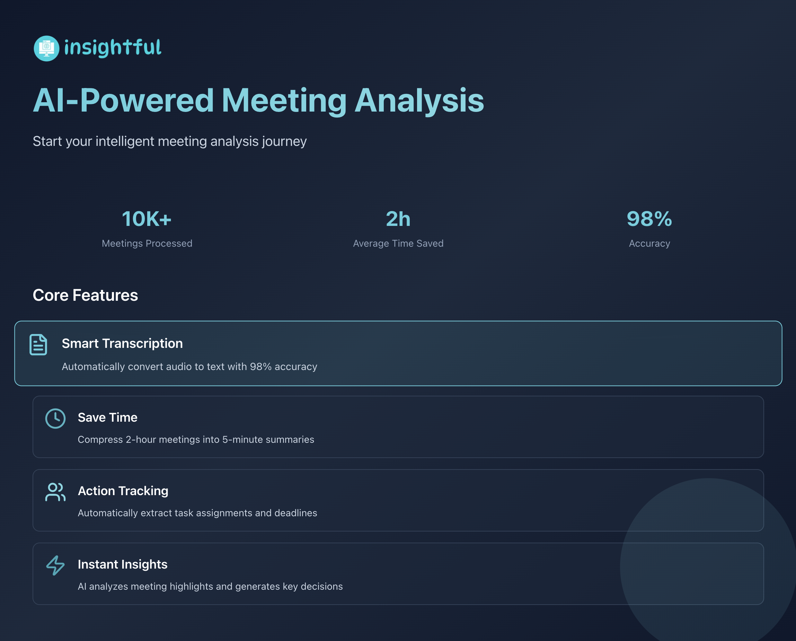

# Insightful - AI-Powered Meeting Summarizer Platform

 <!-- Replace with your actual platform overview screenshot -->

[**English**](./README.md) | [**中文**](./README.zh-CN.md)

**Insightful** is a comprehensive cross-platform solution that leverages the power of Large Language Models to automatically transcribe and summarize meeting recordings. Built as a modern monorepo, it provides seamless experiences across web and mobile platforms with shared business logic and consistent user experiences.

## 🌟 Platform Overview

Insightful consists of multiple applications working together to provide a unified meeting analysis experience:

- **🌐 Web Application** - Full-featured web interface with live recording and file upload capabilities
- **📱 Mobile Applications** - Native iOS and Android apps built with React Native (Coming Soon)
- **🔧 Shared Packages** - Common database schemas, configurations, and utilities

## 🚀 Current Status

### ✅ Completed
- **Web Application** - Production-ready with advanced features including:
  - Live browser-based recording with MediaRecorder API
  - File upload with drag-and-drop interface
  - Real-time AI processing with Google Gemini 1.5 Pro
  - WebSocket-based live status updates
  - Responsive design optimized for mobile browsers
  - GitHub OAuth authentication
  - Comprehensive testing suite

### 🔄 In Development
- **Mobile Applications** - React Native implementation planned with:
  - Native recording capabilities
  - Offline-first architecture
  - Push notifications for job completion
  - Native file system integration
  - Biometric authentication support

## 🏗️ Architecture

```
┌─────────────────────────────────────────────────────────────┐
│                    Insightful Platform                      │
│              AI Meeting Summarizer Ecosystem                │
└─────────────────────────────────────────────────────────────┘

┌─────────────────────────────────────────────────────────────┐
│                    Client Applications                      │
├─────────────────────────────────────────────────────────────┤
│  📱 Mobile Apps (React Native)    │  🌐 Web App (Next.js)   │
│  • iOS Application               │  • Browser Interface     │
│  • Android Application           │  • Live Recording        │
│  • Native Recording              │  • File Upload           │
│  • Offline Support               │  • Real-time Updates     │
│  • Push Notifications            │  • Responsive Design     │
└─────────────────────────────────────────────────────────────┘
                              │
                              ▼
┌─────────────────────────────────────────────────────────────┐
│                    Shared Backend Services                  │
├─────────────────────────────────────────────────────────────┤
│  • Authentication (NextAuth.js + OAuth)                     │
│  • File Storage (Cloudflare R2)                            │
│  • AI Processing (Google Gemini 1.5 Pro)                   │
│  • Real-time Updates (Supabase Realtime)                   │
│  • Task Queue (Upstash QStash)                             │
└─────────────────────────────────────────────────────────────┘
                              │
                              ▼
┌─────────────────────────────────────────────────────────────┐
│                    Shared Packages                          │
├─────────────────────────────────────────────────────────────┤
│  📦 database/         # Prisma schemas & migrations         │
│  📦 eslint-config/    # Shared linting rules               │
│  📦 typescript-config/ # TypeScript configurations         │
│  📦 ui-components/    # Shared UI components (Planned)      │
│  📦 api-client/       # API client library (Planned)       │
└─────────────────────────────────────────────────────────────┘
```

## 📱 Applications

### 🌐 Web Application (`apps/web-app`)

A full-featured Next.js application providing comprehensive meeting analysis capabilities.

**Key Features:**
- 🎙️ **Live Recording** - Browser-based recording with real-time processing
- 📁 **File Upload** - Drag-and-drop interface for audio/video files
- 🤖 **AI Analysis** - Automatic transcription and summarization
- 🔄 **Real-time Updates** - WebSocket-based status synchronization
- 📱 **Mobile Responsive** - Optimized for all screen sizes
- 🔐 **Secure Authentication** - GitHub OAuth integration

**Tech Stack:**
- Next.js 14 with App Router
- TypeScript & Tailwind CSS
- Prisma ORM with PostgreSQL
- Supabase for real-time features
- Google Gemini 1.5 Pro for AI processing

[📖 **Detailed Web App Documentation**](./apps/web-app/README.md)

### 📱 Mobile Applications (`apps/mobile-app`) - Coming Soon

Native mobile applications built with React Native, providing optimized mobile experiences.

**Planned Features:**
- 📱 **Native Recording** - High-quality audio recording with device optimization
- 🔄 **Offline Support** - Queue recordings for processing when online
- 🔔 **Push Notifications** - Real-time alerts for job completion
- 📂 **File Integration** - Native file system access and sharing
- 🔒 **Biometric Auth** - Fingerprint and Face ID support
- 🎨 **Native UI** - Platform-specific design patterns

**Planned Tech Stack:**
- React Native with Expo
- TypeScript
- React Query for state management
- Native modules for recording
- Shared API client from web app

## 🛠️ Shared Packages

### 📦 `packages/database`
Centralized database configuration and schemas using Prisma ORM.

**Contents:**
- Database schema definitions
- Migration files
- Seed data scripts
- Type-safe database client

### 📦 `packages/eslint-config`
Shared ESLint configuration for consistent code quality across all applications.

### 📦 `packages/typescript-config`
Common TypeScript configurations optimized for different application types.

### 📦 `packages/ui-components` (Planned)
Shared React components library for consistent UI across web and mobile.

### 📦 `packages/api-client` (Planned)
Type-safe API client library for communication with backend services.

## 🚀 Getting Started

### Prerequisites

- [Node.js](https://nodejs.org/) (v18 or higher)
- [pnpm](https://pnpm.io/installation)
- [Git](https://git-scm.com/)

### Quick Start

1. **Clone the repository:**
   ```bash
   git clone https://github.com/your-username/insightful.git
   cd insightful
   ```

2. **Install dependencies:**
   ```bash
   pnpm install
   ```

3. **Set up environment variables:**
   ```bash
   cp .env.example .env
   # Fill in the required values in .env
   ```

4. **Initialize the database:**
   ```bash
   pnpm prisma db push --schema=./packages/database/prisma/schema.prisma
   ```

5. **Start development servers:**
   ```bash
   # Start all applications
   pnpm run dev
   
   # Or start specific applications
   pnpm run dev --filter=web-app
   ```

### Development Commands

```bash
# Build all applications
pnpm run build

# Run linting
pnpm run lint

# Format code
pnpm run format

# Type checking
pnpm run check-types
```

## 🚢 Deployment

### Web Application
The web application is optimized for deployment on [Vercel](https://vercel.com/).

1. Connect your GitHub repository to Vercel
2. Set the root directory to `apps/web-app`
3. Configure environment variables
4. Deploy automatically on push to main branch

### Mobile Applications (Future)
Mobile applications will be distributed through:
- **iOS**: App Store via Expo Application Services (EAS)
- **Android**: Google Play Store via EAS
- **Enterprise**: Over-the-air updates via Expo Updates

## 🔮 Roadmap

### Phase 1: Web Platform (✅ Completed)
- [x] Core web application with live recording
- [x] File upload and AI processing
- [x] Real-time status updates
- [x] Responsive mobile web interface
- [x] Production deployment

### Phase 2: Mobile Development (🔄 In Progress)
- [ ] React Native project setup
- [ ] Shared component library
- [ ] Native recording implementation
- [ ] Offline-first architecture
- [ ] Push notification system

### Phase 3: Enhanced Features (📋 Planned)
- [ ] Multi-language support
- [ ] Advanced AI features (speaker identification, sentiment analysis)
- [ ] Team collaboration features
- [ ] Integration with calendar applications
- [ ] Export to various formats (PDF, Word, etc.)

### Phase 4: Enterprise Features (🎯 Future)
- [ ] Single Sign-On (SSO) integration
- [ ] Advanced analytics and reporting
- [ ] Custom AI model training
- [ ] White-label solutions
- [ ] API for third-party integrations

## 🤝 Contributing

We welcome contributions from the community! Please see our [Contributing Guide](./CONTRIBUTING.md) for details.

### Development Workflow

1. Fork the repository
2. Create a feature branch (`git checkout -b feature/amazing-feature`)
3. Make your changes
4. Add tests for new functionality
5. Ensure all tests pass (`pnpm test`)
6. Commit your changes (`git commit -m 'Add amazing feature'`)
7. Push to your branch (`git push origin feature/amazing-feature`)
8. Open a Pull Request

## 📄 License

This project is licensed under the MIT License - see the [LICENSE](./LICENSE) file for details.

## 🙏 Acknowledgments

- [Next.js](https://nextjs.org/) for the amazing React framework
- [React Native](https://reactnative.dev/) for cross-platform mobile development
- [Turborepo](https://turbo.build/) for monorepo management
- [Google Gemini](https://deepmind.google/technologies/gemini/) for AI capabilities
- [Supabase](https://supabase.com/) for real-time database features
- [Vercel](https://vercel.com/) for seamless deployment

---

**Built with ❤️ by the Insightful Team**